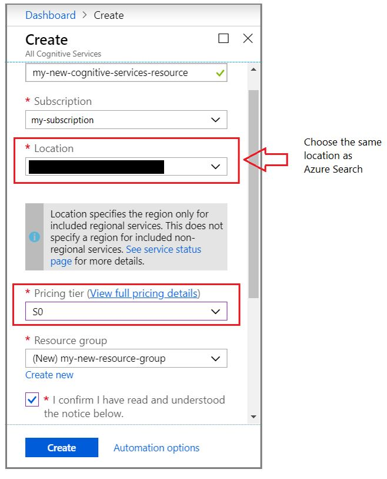
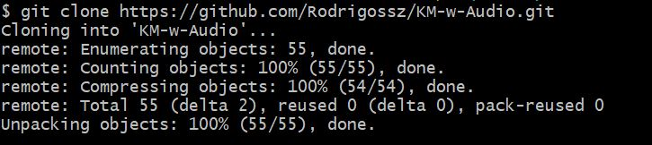
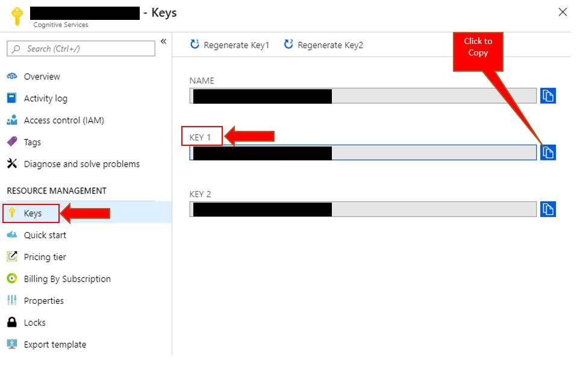
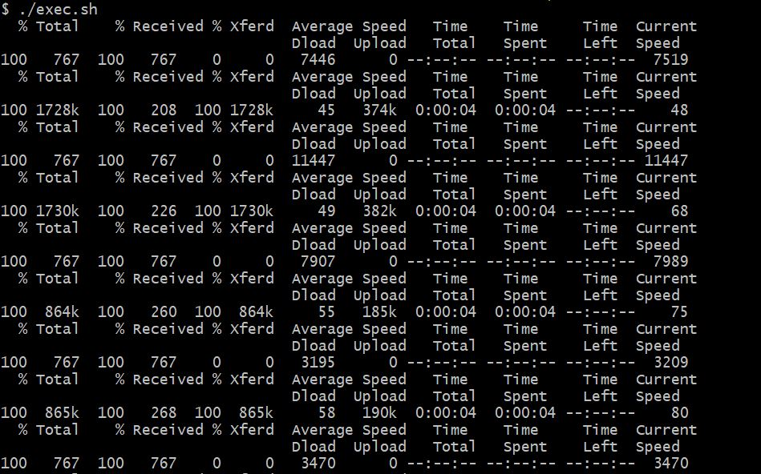
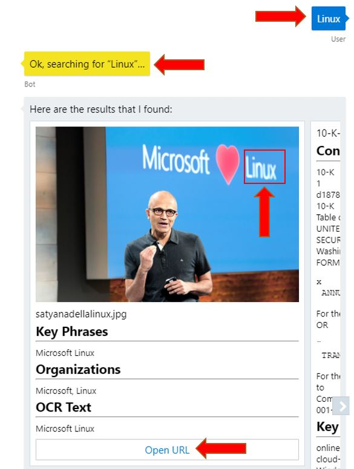
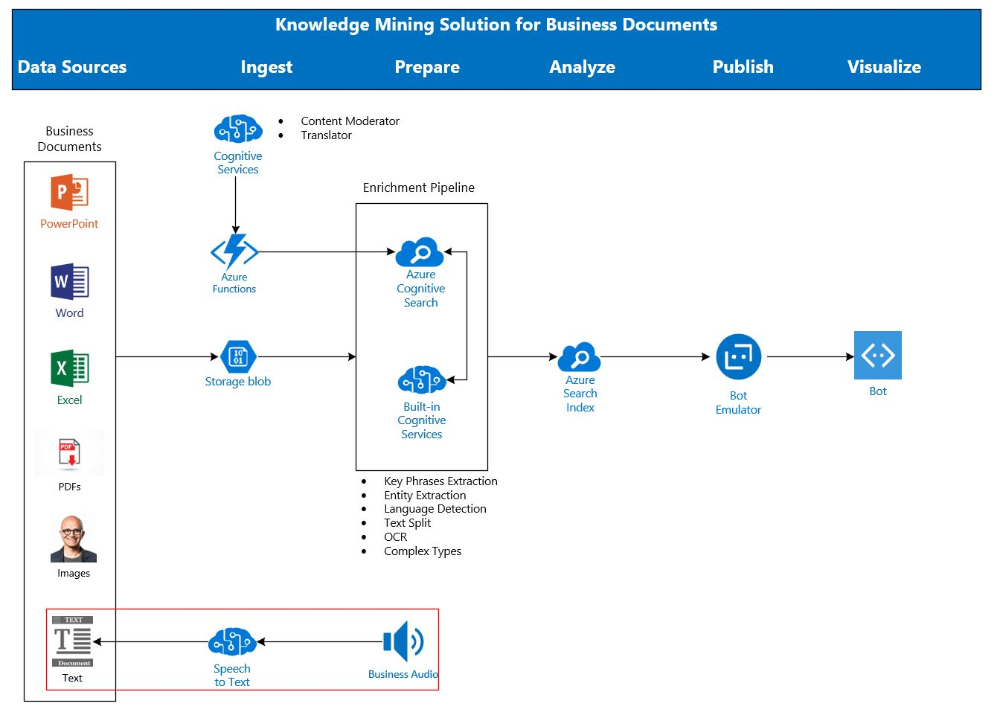

# Use Azure Search and Speech to Text API to mine knowledge from audio

In this lab, you will augment the Knowledge Mining strategy by enriching your Azure Search index with speech extracted from audio files. You will learn how to use the Cognitive Services Speech API to perform a speech-to-text on video files and send this data into blob storage. You will then change your index strucure and job to consider this new information, this should be easy after all the previous labs.

>This GitHub repo has all data and code you need to do this lab.

## Use-case

The need to mix audio data into a Knowledge Mining Solution comes from the moment companies want to search for:

* Audio files from conference calls and meetings
* Extracted audio from videos conferences and trainings
* Audio from postcasts
* CRM audio data

But it is a challenge to do it since Azure Search, the Azure service for Knowledge Mining, only works with text and images.

With the content of this lab, you will be able to create a Knowledge Mining solution that, using Azure Search and Cognitive Services, allows your client or company to perform searches on top of MS-Word documents, MS-Excel spreadsheets, MS-PowerPoint presentations, images, pdfs, and now audio too.

In a real data pipeline for this use-case, the speech-to-text process would be executed as part of a more complex orchestration, **before** the [Cognitive Search Enrichment Pipeline](https://docs.microsoft.com/en-us/azure/search/cognitive-search-quickstart-blob). The following architecture considerations are in place:

* In a batch oriented pipeline, [Azure Data Factory](https://azure.microsoft.com/en-us/services/data-factory/) can be used to execute the extraction and data copying between the storage endpoints of the solutions. The indexer job schedule becomes the smallest interval that make the data searchable.
* Lower latencies can also be achieved with custom extraction in data flow applications, updating the Azure Search index directly through its REST API

## Pre Reqs

1. *To Read (10 minutes):* [Azure Search Overview](https://docs.microsoft.com/en-us/azure/search/search-what-is-azure-search)
2. *To Install (10 minutes):* [Git for Windows](https://gitforwindows.org/), to clone the repo and execute the sh scripts
3. *To Create (10 minutes):* [Azure Free Account](https://azure.microsoft.com/en-us/free/). Not necessary if you already have a subscription where you can create Search and Cognitive services.

## Dataset

The audio dataset is part of [Microsoft Research Podcast](https://www.microsoft.com/en-us/research/blog/category/podcast/). The original files are too large for this lab, close to 80 MB each one. Another problem is the mp3 format, what is not compatible with the free version of the API. Big mp3 files will be addressed in another lab, in a near future.

To keep the GitHub repo as small as possible, and to keep this lab free, snippets from the original audios were extracted. Their total size is close to 18 MB. But the audios will not be taken to Azure, only their metadata, created with the Microsoft AI service. These meta-stats will occupy less than 10 MB of a blob storage and Azure Search index.

The dataset also has Microsoft public documents like presentations, images, white-papers, etc. All these documents will use less than 50 MB of a blob storage. They will be used to allow you a rich search experience.

**The total dataset size is less the 100 MB with a big safety margin.**

## Costs

There is no cost since you will be using the following services in an Azure Free Account:

* Blob Storage with LRS (local replication)
* Azure Search Free Tier
* Azure Speech Cognitive Services Free Tier

> If you are using existing Azure services, click [here](https://azure.microsoft.com/en-us/pricing/calculator/) for the pricing. Consider the size of the dataset quoted above and fewer than 10 executions of the cognitive services used in this lab.

## Limitations

Stay tunned! The following limitatios will be addressed in a future lab:

1. MP3 files
2. Files bigger than 15 MB
3. Audio Files on Azure, to be opened from the Azure Search results

When this occurs, it will be advertised in the following locations:

* Azure AI Customer Engineering Blog - <http://aka.ms/ACE-Blog>
* My LinkedIn feed - <https://www.linkedin.com/in/rodrigossz/>
* My Personal Blog - <https://datanewoil.tumblr.com/>
* My Personal Twitter - <https://twitter.com/Rodrigosqsz>

## Workflow

The activities you will do in this lab are:

1. Create the environment
2. Clone this GitHub repo, what will download audios and scripts to your computer
3. Extract text from small audio files using [Speech-to-Text](https://docs.microsoft.com/en-us/azure/cognitive-services/speech-service/speech-to-text)
4. Upload the Json Files to your Storage Account
5. Import the data into Azure Search
6. Query the data

## Create the Environment

On the Azure Portal, using your subscription, create all of the  services listed below. **To simplify the process, all resources must be in the same resource group and in the Azure WEST US 2 region**. If you want, you can click [here](https://azure.microsoft.com/en-us/global-infrastructure/services/?products=cognitive-services) and choose another region where Speech Services have general availability. But again, all resources must be in the same region. The resources to be crated are:

* Azure Search service: Just follow [this](https://docs.microsoft.com/en-us/azure/search/search-create-service-portal) process, choosing the **Free** tier. You'll probably have to create a new resource group. Do it and use it for all other services below.

* Speech to Text Service: Just follow [this](https://docs.microsoft.com/en-us/azure/cognitive-services/speech-service/get-started) process to create your Speech to Text API in Azure Portal, choosing the **F0** tier.

* Storage Account: Just follow [this](https://docs.microsoft.com/en-us/azure/storage/common/storage-quickstart-create-account) process to create your storage on Azure. Use **LRS** for the replication, since this is not a production environment.

* Blog Container: Just follow [this](https://docs.microsoft.com/en-us/azure/storage/blobs/storage-quickstart-blobs-portal#create-a-container) process to create a container within the storage account you just created above.

* In the same region you have been using since the begining, use [this](https://docs.microsoft.com/en-us/azure/search/cognitive-search-attach-cognitive-services) process to create a Cognitive Services resource. It will be necessary because we have more the 20 files. And it'll be used at the **Import Data** step. This resource is required for billing proposes. The image below will help you to create this service.

## Clone the Repo

Cloning the repo will download all the training materials to your computer, including the dataset.

1. In the Cortana search bar, type "Git Bash" and select **Git Bash Desktop App**.

2. Next, type `cd c:\` then enter. Now, you will be in the root directory of your computer. If you don't have permission to create folders and files here, navigate to a folder where you can download the Bootcamp materials.

3. Type and enter `git clone https://github.com/Rodrigossz/KM-w-Audio.git`

4. *Validation step*: Go to **C:\KM-w-Audio**, or any other folder you have created, and confirm it exists, including the dataset in the resources folder.

>Note! The image above may have a different number r of files downloaded, the training is under constant development.

## Extract text from audio files using the Speech Services

* Go to the `scripts` folder and open `get-text.sh` script file with Notepad or any other editor. Don't double click it, use the Windows Explorer context menu to `right click` + `open`. It's a script that will submit `.wav` files from the `dataset` folder to the Speech to Text API. Don't change anything, just note that this script expects 3 parameters:

  * Azure Region name: If you used **West US 2** to create your services, you should use `westus2`. If you used any other region, run `az account list-locations -o table` from your command prompt to list all regions names. If you don't have **Azure CLI** in your computer, you can [install it](https://docs.microsoft.com/en-us/cli/azure/install-azure-cli?view=azure-cli-latest) or run it from your Azure Portal, using the [Azure Cloud Shell](https://docs.microsoft.com/en-us/azure/cloud-shell/overview).

  * Subscription Key: this is the key of your Cognitive Service Speech to Text API. Use to image below to help you find, and copy, your key. You can use **Key 1**.

  

  * File name: The name of the `.wav` file in the dataset folder.

* Close the `get-text.sh` file and in the same folder, open `exec.sh`. This script submitts the first one for every file in the `dataset` folder. Edit this file adding your Azure Region and your Speech Service key. If haven't changed the folders structre, you don't need to worry about the path. Save and close the file.

* Using **Git Bash**, navigate to the `scripts` folder and execute `./exec.sh`. It will print logs in your terminal and create json files in the `dataset` folder. You should see something like the image below.

* Open one or two json files, with any editor like Notepad, to see what kind of data was created. Basically, you show see some metadada and the transcription of the audio. Now you have text data about your audio files. This is the data that we will search for, using Azure Search. Please note that the audio file original name is contained in the json file name. This will help in the future for any application to do the match between audio and transcription files.

## Upload the Data to your Storage Account

Azure Search only indexes data on Azure. That's why we need to upload the data to a storage account, one of the possible data sources. Using [Azure Storage Explorer](https://azure.microsoft.com/en-us/features/storage-explorer/) or the [Azure Portal](https://docs.microsoft.com/en-us/azure/storage/blobs/storage-quickstart-blobs-portal#upload-a-block-blob), upload the json files to the storage account you created before. Use the same blob container you created in the previous step. **Don't upload the wav files!!!**

Using the same method, and for the same container, upload the files of the `dataset2` folder. At this point, you should have json, ppt, word and image files in your blob container.

## Import the data into Azure Search

Use [this](https://docs.microsoft.com/en-us/azure/search/cognitive-search-quickstart-blob#create-the-enrichment-pipeline) to import data, but with some differences:

1. Instead of the free resource, use that one created in the beggining of the lab
2. Enable OCR
3. Extract Key Phrases too, not only people/oganization/location names
4. Mark the content as retrievable

This process is called enrichment and uses AI to add content extraction, natural language processing (NLP), and image processing skills to an Azure Search indexing pipeline, making unsearchable or unstructured content more searchable.

Run the indexer and use the Azure Search Portal dashboard to [monitor](https://docs.microsoft.com/en-us/azure/search/search-howto-monitor-indexers) the execution.

## Query the data

Using the [Search Explorer](https://docs.microsoft.com/en-us/azure/search/search-explorer), query the data for the following terms:

* Linux
* Developing
* Cloud
* Open
* Gestures
* Working
* Processing
* wav
* video game
* Knowledge Mining
* Azure
* AI

You should be able to see images and audio files in you result set. Using any tool or method you like, compare the results with the related files from the dataset folders.

## Closing

For a deep Azure Cognitive Search experience, use the [Knowledge Mining Bootcamp](https://github.com/Azure/LearnAI-KnowledgeMiningBootcamp). You will learn how to create a Bot to query **and open** your business documents, as you can see in the image below.

If you use this lab as a complement to KMB, you'll end up having the architecture below.

Stay tunned! The following limitatios will be addressed in a future lab:

1. MP3 files
2. Files bigger than 15 MB
3. Audio Files on Azure, to be opened from the Azure Search results

When this occurs, it will be advertised in the following locations:

* Azure AI Customer Engineering Blog - <http://aka.ms/ACE-Blog>
* My LinkedIn feed - <https://www.linkedin.com/in/rodrigossz/>
* My Personal Blog - <https://datanewoil.tumblr.com/>
* My Personal Twitter - <https://twitter.com/Rodrigosqsz>
